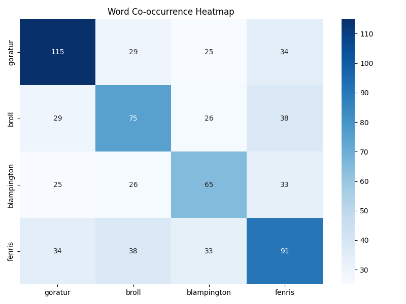

# Statistical Analysis of Multi-Year DND Campaign

This is a basic exploration of our multi-year DND campaign. We generate basic statistics over our domain as well as sentiment scores using FLAN-T5 LLM (https://huggingface.co/docs/transformers/en/model_doc/flan-t5), a pre-trained open-source language model.

Here are some descriptive statistics of the notes over time (where time is defined as chunks of 100 characters of text in a set of notes taken by a member of our campaign)

We take advantage of pre-training of FLAN-T5 to do zero-shot classification of broad sentiment [positive, negative, neutral] of the campaign over time (see below).

`"Classify sentiment [positive, negative, neutral]: "`

Clearly, the model judged the overall sentiment of the campaign as broadly negative, which comports with our gameplay style of violence.

We can generalize this zero-shot classification at the character-level.

`"Classify sentiment about Goratur [positive, negative, neutral]: "`

We can further improve classification by feeding few-shot examples into the prompt. Note below some simple examples of classification broadly agree with the zero-shot analysis.

---

## How to Run

1. Clone the repo `git clone https://github.com/ZacharyCosenza/dnd.git`
2. Install dependencies  
3. `python main.py`

## Rules

1. Don't work on `main` branch unless small updates
2. Heavy work should be on `dev` branch.