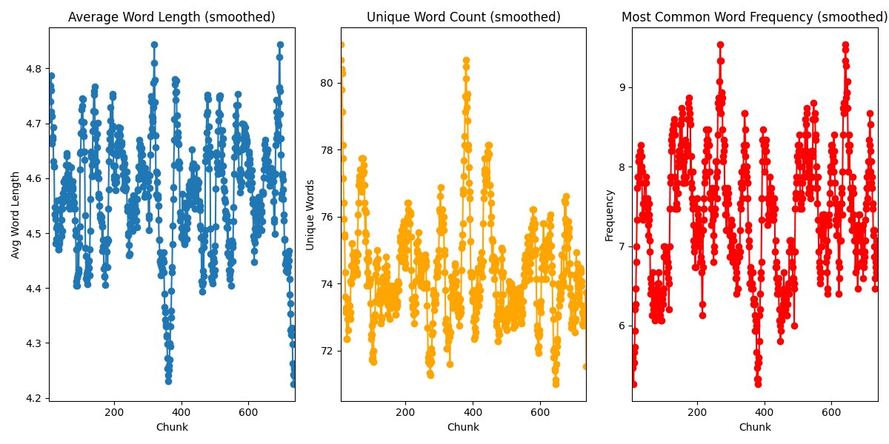

# Statistical Analysis of Multi-Year DND Campaign

This is a basic exploration of our multi-year DND campaign. We generate basic statistics over our domain as well as sentiment scores using FLAN-T5 LLM (https://huggingface.co/docs/transformers/en/model_doc/flan-t5), a pre-trained open-source language model.

According to the descriptive statistics of the campaign (where time is defined as chunks of 100 characters of text in a set of notes taken by a member of our campaign), unique word count and most common word frequency decrease and increase over time respectivley. There is a discontinuity at roughly chunk 300 due to document changes.

We can also look at chunk-level word co-occurances for the primary characters `['goratur', 'broll', 'blampington', 'fenris']` for friendship mapping.

We take advantage of pre-training of FLAN-T5 to do zero-shot classification of broad sentiment [positive, negative, neutral] of the campaign over time (see below). Running averages are calculated using a window of 5 chunks.

`"Classify sentiment [positive, negative, neutral]: "`

Clearly, the model judged the overall sentiment of the campaign as broadly negative but increasing over time, which comports with our gameplay style of violence. To test character-level sentiment scores, Goratur sentiment was computed with zero-shot and few-shot classification. Zero-shot character sentiment follows genetic sentiment, indicating the FLAN-T5 model is not robust enough to distinguish character-level sentiment without few-shot examples. Notice Goratur-level sentiment was noticably lower than overall campaign sentiment.

---

## How to Run

1. Clone the repo `git clone https://github.com/ZacharyCosenza/dnd.git`
2. Install dependencies  
3. `python main.py`

## Rules

1. Don't work on `main` branch unless small updates
2. Heavy work should be on `dev` branch.